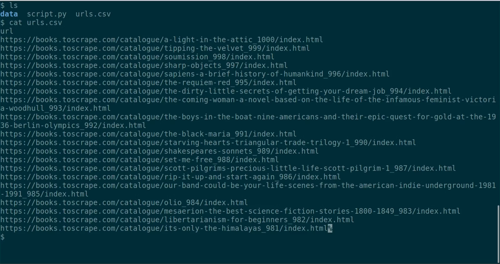
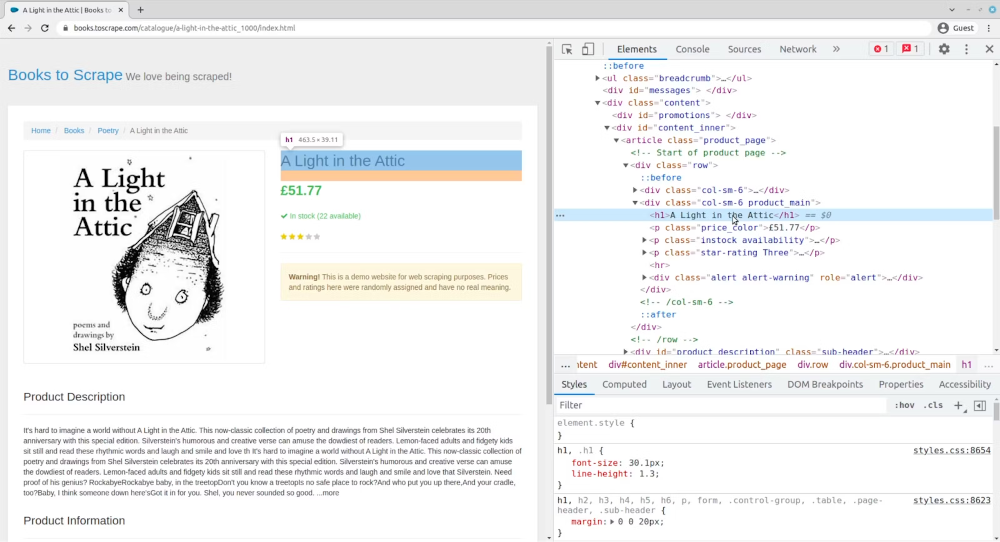
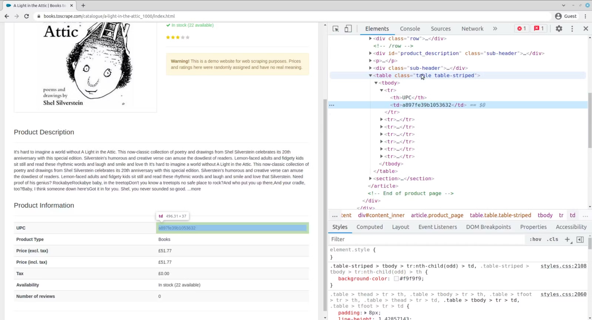
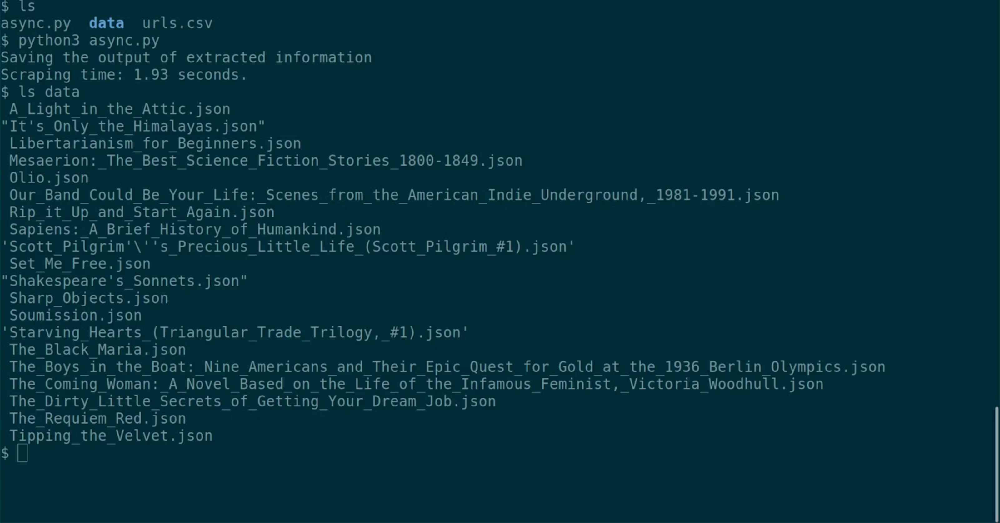
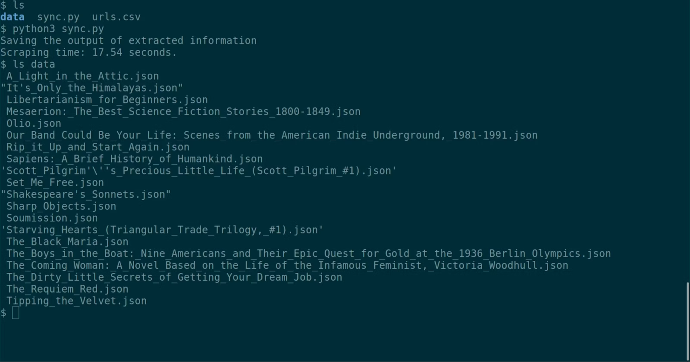
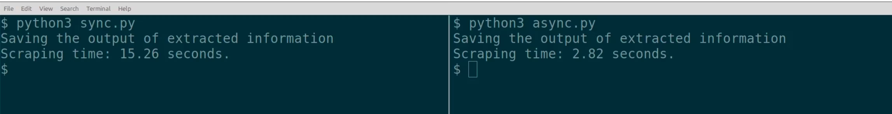

# Asynchronous Web Scraping With Python & AIOHTTP

- [Sending asynchronous HTTP requests](#sending-asynchronous-http-requests)
  * [1. Create an empty Python file with a main function](#1-create-an-empty-python-file-with-a-main-function)
  * [2. Track script execution time](#2-track-script-execution-time)
  * [3. Create a loop](#3-create-a-loop)
  * [4. Create a scrape functionality](#4-create-a-scrape-functionality)
  * [5. Add save_product function](#5-add-save_product-function)
  * [6. Run the script](#6-run-the-script)
- [Sending synchronous HTTP requests](#sending-synchronous-http-requests)
  * [1. Create a Python file with a main function](#1-create-a-python-file-with-a-main-function)
  * [2. Track script execution time](#2-track-script-execution-time-1)
  * [3. Create a loop](#3-create-a-loop-1)
  * [4. Create a scrape function](#4-create-a-scrape-function)
  * [5. Add save_product function](#5-add-save_product-function-1)
  * [6. Run the script](#6-run-the-script-1)
- [Comparing the performance of sync and async](#comparing-the-performance-of-sync-and-async)

In this tutorial, we will focus on scraping multiple URLs using the asynchronous method, and by comparing it to the synchronous one, we will demonstrate why it can be more beneficial. See the [<u>full blog
post</u>](https://oxylabs.io/blog/asynchronous-web-scraping-python-aiohttp)
for more information on asynchronous web scraping.

You can also check out [<u>one of our videos</u>](https://www.youtube.com/watch?v=Raa9f5kpvtE) for a visual representation of
the same web scraping tutorial.

## Sending asynchronous HTTP requests

Let’s take a look at the asynchronous Python tutorial. For this
use-case, we will use the `aiohttp` module.

### 1. Create an empty Python file with a main function

Note that the main function is marked as asynchronous. We use asyncio
loop to prevent the script from exiting until the main function
completes.
```python
import asyncio


async def main():
    print('Saving the output of extracted information')


loop = asyncio.get_event_loop()
loop.run_until_complete(main())
```

Once again, it is a good idea to track the performance of your script.
For that purpose, let's write a code that tracks script execution time.

### 2. Track script execution time

As with the first example, record the time at the start of the script.
Then, type in any code that you need to measure (currently a single
`print` statement). Finally, calculate how much time has passed by taking
the current time and subtracting the time at the start of the script.
Once we have how much time has passed, we print it while rounding the
resulting float to the last 2 decimals.

```python
import asyncio
import time


async def main():
    start_time = time.time()

    print('Saving the output of extracted information')

    time_difference = time.time() - start_time
    print(f'Scraping time: %.2f seconds.' % time_difference)


loop = asyncio.get_event_loop()
loop.run_until_complete(main())
```

Time to read the csv file that contains URLs. The file will contain a
single column called `url`. There, you will see all the URLs that need to
be scraped for data.



### 3. Create a loop

Next, we open up urls.csv, then load it using csv module and loop over
each and every URL in the csv file. Additionally, we need to create an
async task for every URL we are going to scrape.

```python
import asyncio
import csv
import time


async def main():
    start_time = time.time()

    with open('urls.csv') as file:
        csv_reader = csv.DictReader(file)
        for csv_row in csv_reader:
            # the url from csv can be found in csv_row['url']
            print(csv_row['url'])

    print('Saving the output of extracted information')

    time_difference = time.time() - start_time
    print(f'Scraping time: %.2f seconds.' % time_difference)


loop = asyncio.get_event_loop()
loop.run_until_complete(main())
```

Later in the function we wait for all the scraping tasks to complete
before moving on.

```python
import asyncio
import csv
import time


async def main():
    start_time = time.time()

    tasks = []
    with open('urls.csv') as file:
        csv_reader = csv.DictReader(file)
        for csv_row in csv_reader:
            task = asyncio.create_task(scrape(csv_row['url']))
            tasks.append(task)

    print('Saving the output of extracted information')
    await asyncio.gather(*tasks)

    time_difference = time.time() - start_time
    print(f'Scraping time: %.2f seconds.' % time_difference)


loop = asyncio.get_event_loop()
loop.run_until_complete(main())
```

All that's left is scraping! But before doing that, remember to take a
look at the data you're scraping.

The [<u>title of the
book</u>](https://books.toscrape.com/catalogue/a-light-in-the-attic_1000/index.html)
can be extracted from an `<h1>` tag, that is wrapped by a `<div>` tag
with a `product_main` class.



Regarding the production information, it can be found in a table with a
`table-striped` class.



### 4. Create a scrape functionality

The scrape function makes a request to the URL we loaded from the csv
file. Once the request is done, it loads the response HTML using the
BeautifulSoup module. Then we use the knowledge about where the data is
stored in HTML tags to extract the book name into the `book_name` variable
and collect all product information into a `product_info` dictionary.

```python
import asyncio
import csv
import time
import aiohttp as aiohttp
from bs4 import BeautifulSoup


async def scrape(url):
    async with aiohttp.ClientSession() as session:
        async with session.get(url) as resp:
            body = await resp.text()
            soup = BeautifulSoup(body, 'html.parser')
            book_name = soup.select_one('.product_main').h1.text
            rows = soup.select('.table.table-striped tr')
            product_info = {row.th.text: row.td.text for row in rows}


async def main():
    start_time = time.time()

    tasks = []
    with open('urls.csv') as file:
        csv_reader = csv.DictReader(file)
        for csv_row in csv_reader:
            task = asyncio.create_task(scrape(csv_row['url']))
            tasks.append(task)

    print('Saving the output of extracted information')
    await asyncio.gather(*tasks)

    time_difference = time.time() - start_time
    print(f'Scraping time: %.2f seconds.' % time_difference)


loop = asyncio.get_event_loop()
loop.run_until_complete(main())
```

### 5. Add save_product function

The URL is scraped; however, no results can be seen. For that, you need
to add another function – `save_product`.

`save_product` takes two parameters: the book name and the product info
dictionary. Since the book name contains spaces, we first replace them
with underscores. Finally, we create a json file and dump all the info
we have into it.

```python
import asyncio
import csv
import json
import time
import aiohttp
from bs4 import BeautifulSoup


async def save_product(book_name, product_info):
    json_file_name = book_name.replace(' ', '_')
    with open(f'data/{json_file_name}.json', 'w') as book_file:
        json.dump(product_info, book_file)


async def scrape(url):
    async with aiohttp.ClientSession() as session:
        async with session.get(url) as resp:
            body = await resp.text()
            soup = BeautifulSoup(body, 'html.parser')
            book_name = soup.select_one('.product_main').h1.text
            rows = soup.select('.table.table-striped tr')
            product_info = {row.th.text: row.td.text for row in rows}
            await save_product(book_name, product_info)


async def main():
    start_time = time.time()

    tasks = []
    with open('urls.csv') as file:
        csv_reader = csv.DictReader(file)
        for csv_row in csv_reader:
            task = asyncio.create_task(scrape(csv_row['url']))
            tasks.append(task)

    print('Saving the output of extracted information')
    await asyncio.gather(*tasks)

    time_difference = time.time() - start_time
    print(f'Scraping time: %.2f seconds.' % time_difference)


loop = asyncio.get_event_loop()
loop.run_until_complete(main())
```

### 6. Run the script

Lastly, you can run the script and see the data.



## Sending synchronous HTTP requests

In this tutorial we are going to scrape URLs defined in urls.csv using a
synchronous approach. For this particular use case, the Python `requests`
module is an ideal tool.

### 1. Create a Python file with a main function
```python
def main():
    print('Saving the output of extracted information')

main()
```

Tracking the performance of your script is always a good idea.
Therefore, the next step is to add a code that tracks script execution
time.

### 2. Track script execution time

First, record time at the very start of the script. Then, type in any
code that needs to be measured – in this case, we are using a single
`print` statement. Finally, calculate how much time has passed. This can
be done by taking the current time and subtracting the time at the start
of the script. Once we know how much time has passed, we can print it
while rounding the resulting float to the last 2 decimals.

```python
import time


def main():
    start_time = time.time()

    print('Saving the output of extracted information')

    time_difference = time.time() - start_time
    print(f'Scraping time: %.2f seconds.' % time_difference)

main()
```

Now that the preparations are done, it's time to read the csv file that
contains URLs. There, you will see a single column called `url`, which
will contain URLs that have to be scraped for data.

### 3. Create a loop

Next, we have to open up urls.csv. After that, load it using the csv
module and loop over each and every URL from the csv file.

```python
import csv
import time


def main():
    start_time = time.time()

    print('Saving the output of extracted information')
    with open('urls.csv') as file:
        csv_reader = csv.DictReader(file)
        for csv_row in csv_reader:
            # the url from csv can be found in csv_row['url']
            print(csv_row['url'])

    time_difference = time.time() - start_time
    print(f'Scraping time: %.2f seconds.' % time_difference)

main()
```

At this point, the job is almost done - all that’s left to do is to
scrape it, although before you do that, look at the data you’re
scraping.

The title of the book “A Light in the Attic” can be extracted from an
`<h1>` tag, that is wrapped by a `<div>` tag with a `product_main` class.


As for the product information, it can be found in a table with a
`table-striped` class, which you can see in the developer tools part.


### 4. Create a scrape function

Now, let's use what we've learned and create a `scrape` function.

The scrape function makes a request to the URL we loaded from the csv
file. Once the request is done, it loads the response HTML using the
BeautifulSoup module. Then, we use the knowledge about where the data is
stored in HTML tags to extract the book name into the `book_name` variable
and collect all product information into a `product_info` dictionary.

```python
import csv
import time
import requests as requests
from bs4 import BeautifulSoup


def scrape(url):
    response = requests.get(url)
    soup = BeautifulSoup(response.content, 'html.parser')
    book_name = soup.select_one('.product_main').h1.text
    rows = soup.select('.table.table-striped tr')
    product_info = {row.th.text: row.td.text for row in rows}

def main():
    start_time = time.time()

    print('Saving the output of extracted information')
    with open('urls.csv') as file:
        csv_reader = csv.DictReader(file)
        for csv_row in csv_reader:
            scrape(csv_row['url'])

    time_difference = time.time() - start_time
    print(f'Scraping time: %.2f seconds.' % time_difference)


main()
```

The URL is scraped; however, no results are seen yet. For that, it’s
time to add yet another function - `save_product`.

### 5. Add save_product function

`save_product` takes two parameters: the book name and the product info
dictionary. Since the book name contains spaces, we first replace them
with underscores. Finally, we create a JSON file and dump all the info
we have into it. Make sure you create a data directory in the folder of
your script where all the JSON files are going to be saved.

```python
import csv
import json
import time
import requests
from bs4 import BeautifulSoup


def save_product(book_name, product_info):
    json_file_name = book_name.replace(' ', '_')
    with open(f'data/{json_file_name}.json', 'w') as book_file:
        json.dump(product_info, book_file)


def scrape(url):
    response = requests.get(url)
    soup = BeautifulSoup(response.content, 'html.parser')
    book_name = soup.select_one('.product_main').h1.text
    rows = soup.select('.table.table-striped tr')
    product_info = {row.th.text: row.td.text for row in rows}
    save_product(book_name, product_info)


def main():
    start_time = time.time()

    print('Saving the output of extracted information')
    with open('urls.csv') as file:
        csv_reader = csv.DictReader(file)
        for csv_row in csv_reader:
            scrape(csv_row['url'])

    time_difference = time.time() - start_time
    print(f'Scraping time: %.2f seconds.' % time_difference)


main()
```

### 6. Run the script

Now, it's time to run the script and see the data. Here, we can also see
how much time the scraping took – in this case it’s 17.54 seconds.



## Comparing the performance of sync and async

Now that we carefully went through the processes of making requests with
both synchronous and asynchronous methods, we can run the requests once
again and compare the performance of two scripts.

The time difference is huge – while the async web scraping code was able
to execute all the tasks in around 3 seconds, it took almost 16 for the
synchronous one. This proves that scraping asynchronously is indeed more
beneficial due to its noticeable time efficiency.


